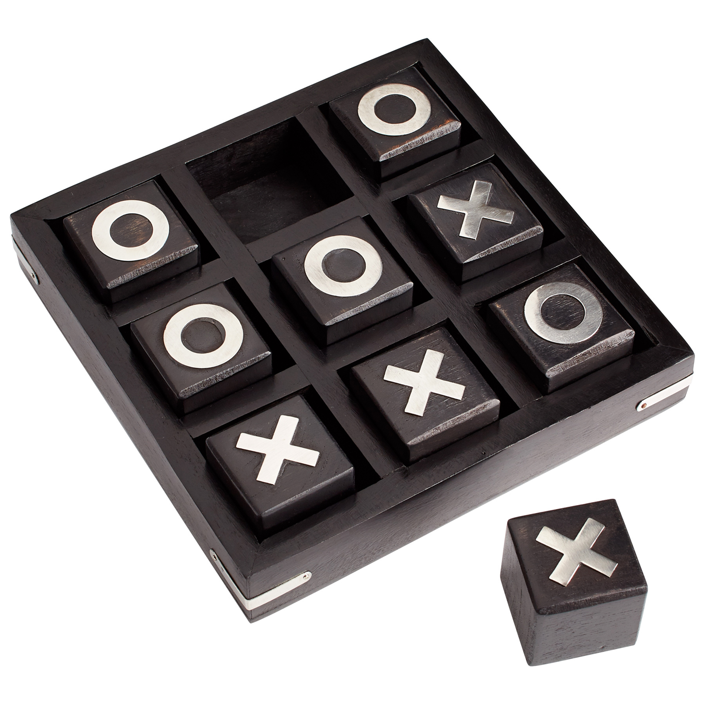
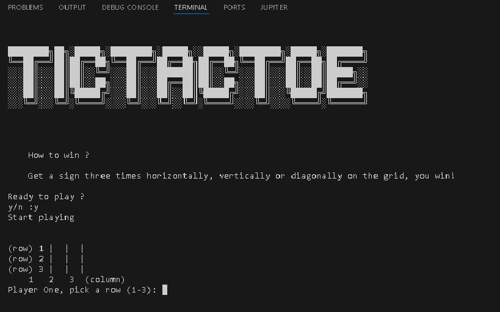

<h1 align="center"> Tictactoe in a Terminal Built with Python </h1>

   
   

| Team | GitHub |Country
|:-----------:|:-----------:|:-----------:|
| Jeffer Max        |[@M21x1](https://github.com/M21x1)           |	

Tictactoe or Noughts and Crosses is a two player, they take turns, game where the only rule to win is to draw the same sign vertically, horizontally or diagonally on a three by three grid. 

 We will build the program using 5 modules:

<ul>
  <li>The grid printer</li>
  <li>The input getter</li>
  <li>The switch player</li>
  <li>The winner determiner</li>
  <li>The game developer</li>
</ul>

<h2>How things work</h2>

The above list can be daunting but no worries..I was too, hehe.
 
 

First, the grid printer is a function that uses a dictionary to print out an initial frame where the players will be placing their signs.

 

Second, the input getter is where the terminal will ask a player to input a sign, imposing some restriction to not cause an error in the game like the input must be a number between 1 - 3.

 

Third, the switch player is the most simple function of them all, it just changes turns between players.

 

Fourth, the winner determiner is like a filter to check horizontally, vertically and diagonally if one of the player got three consecutive signs.

 

Finally, the game developer relates the four functions described and initializes the game.

 

 

